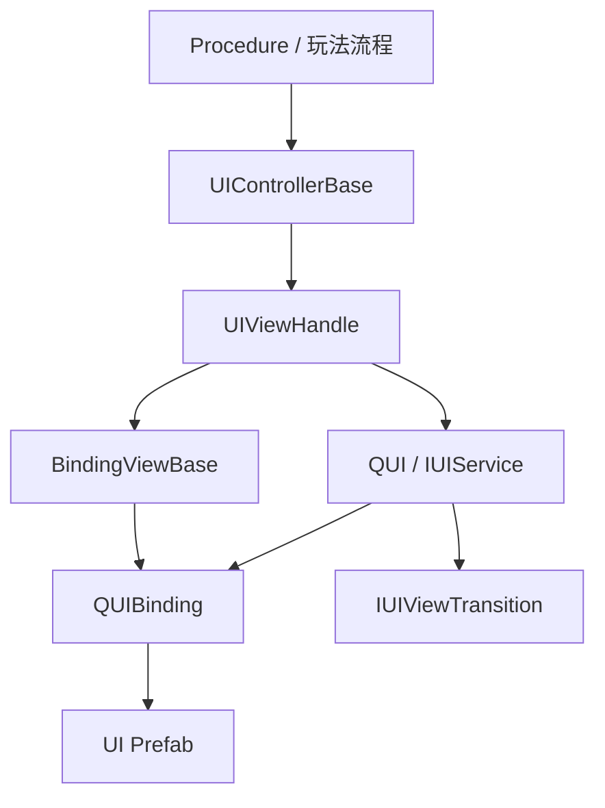
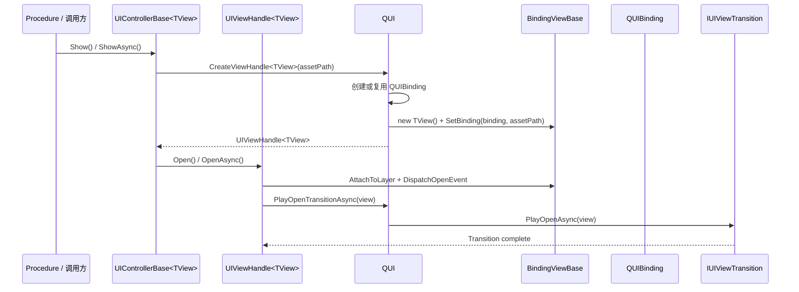
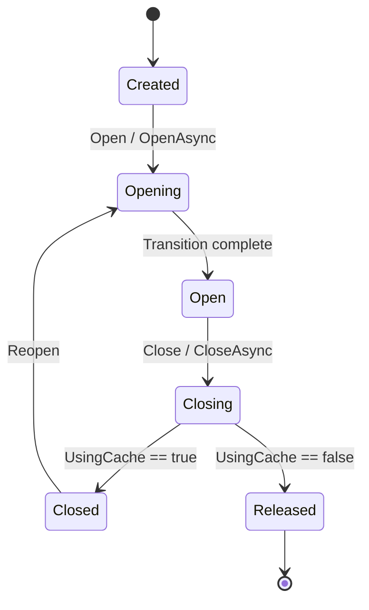

# EFrame UI 框架指南

本文描述 EFrame 当前 UI Runtime 结构。UI 主链已经重构为 handle-first 模型。它主要用于框架维护、调试和高级扩展。

新的可浏览文档站点请从 [Documentation~/index.html](../index.html) 进入，再打开 [Documentation~/runtime/ui/index.html](../runtime/ui/index.html)。

普通业务 UI 使用优先阅读更简单的端到端示例 [UI_USAGE_EXAMPLE.md](UI_USAGE_EXAMPLE.md)：创建 prefab binding，生成 View 访问类，然后编写 `UIControllerBase<TGeneratedView>`。

核心规则很简单：runtime UI 生命周期现在通过 `QUI` + `UIViewHandle` 流转，而不是直接调用 `BindingViewBase.Open/Close`。

## 0. 快速视觉总览

### 结构图



阅读顺序：

- 业务流程与 controller 交互
- controller 拥有 handle
- handle 拥有 runtime 生命周期
- `QUI` 拥有 binding 创建、缓存、层级和 transition 等宿主职责
- view 贴近 prefab binding 和强类型组件访问

## 1. 核心角色

### `QUI`

`QUI` 是由 `EFrameContext` 拥有的 UI 宿主。

它负责：

- 创建 `QUIBinding`
- 创建 `BindingViewBase` wrapper 和 `UIViewHandle<TView>` handle
- 将 UI 挂到框架层级
- 缓存 `QUIBinding` / `GameObject` 实例
- 拥有默认 `IUIViewTransition`
- 拥有可选的导航栈状态

通过以下方式访问：

```csharp
var ui = EFrame.UI;
```

### `BindingViewBase`

`BindingViewBase` 现在是 `QUIBinding` 的轻量 wrapper。

它负责：

- 从 binding prefab 暴露强类型组件访问
- 在 `OnBindingSet()` 中缓存引用
- 持有宿主 / handle 链使用的底层生命周期原语

它不再是公开生命周期 API。业务代码不应直接在 view 上调用 `Open`、`Close`、`OpenAsync` 或 `CloseAsync`。

### `UIViewHandle<TView>`

`UIViewHandle<TView>` 现在是 runtime 生命周期拥有者。

它负责：

- 打开和关闭 UI 实例
- 跟踪 `Created`、`Closed`、`Opening`、`Open`、`Closing`、`Released` 等 runtime 状态
- 在 `Closed` 状态中保留可复用的缓存实例
- 为 runtime 流程提供唯一的公开 open/close 入口

### `UIControllerBase<TView>`

`UIControllerBase<TView>` 是编排层。

它负责：

- 决定 UI 何时显示或隐藏
- 拥有 view handle
- 默认绑定 `EFrame.Current`，普通业务创建 controller 后直接 `Show()` / `Hide()`
- 在 `OnViewCreated()` 中绑定实例级事件
- 在 `OnViewOpened()` 中刷新每次打开的状态
- 在 `OnViewClosed()` 中于关闭开始时暂停每次打开相关的工作
- 在 `OnViewDestroyed()` 中清理实例级状态
- 通过 `EFrame.UI.Queue` 和 `EnqueueToShow()` / `EnqueueToShowAsync()` 支持弹窗、引导、奖励提示等 UI 顺序展示

它现在暴露：

- `ViewHandle`：非泛型访问
- `TypedViewHandle`：强类型访问
- `EnqueueToShow()`：入队顺序展示，返回可等待的 `UIQueueTicket`
- `EnqueueToShowAsync()`：入队并等待此 UI 关闭

它不再暴露旧的 `View` 门面。

## 2. Runtime 结构

`packages/com.eframework.core/Runtime/UI/` 下当前 runtime UI 目录：

- `BindingViewBase.cs`：bound view 的轻量 wrapper 基类
- `QUI.cs`：UI 宿主、缓存拥有者、transition 拥有者、导航栈拥有者
- `QUIBinding.cs`：prefab binding 组件和 `ViewConfig`
- `UIControllerBase.cs`：controller 和 popup controller 基类
- `Handles/`：runtime handle 抽象
- `Transitions/`：宿主拥有的默认 transition 抽象
- `Components/`：可复用核心 UI 控件，例如 `QScroller`
- `Layout/`：屏幕适配和安全区工具
- `Transitions/`：宿主拥有的 transition 抽象和内置 transition

`CheckableButton`、`Tabbar`、`EmptyRayCasterGraphic`、`UIRoundedRectImage`、`UISmoothFill`、`UIInteractionGuard`、`UIInteractionReporter`、`UIInteractionFeedback`、`QVirtualListView` 和 `QVirtualGridView` 位于可选 `com.eframework.ui-extras` package 中。大多数 extras 使用 `EFramework.Extensions.UI.Extras.*`；virtual list/grid 类型保留 `EFramework.Extensions.UI.VirtualList` 命名空间。

Virtual list/grid item 模板可以处于 inactive；池化实例会在内部激活。当模板写在 view 层级内时，请让源模板保持 inactive 或放在 viewport 外，因为控件管理的是池化实例，而不是模板对象本身。如果外部布局代码改变 viewport 尺寸但没有触发 Unity RectTransform 尺寸回调，请调用 `RefreshLayout()`。

## 3. 推荐流程

常规 runtime 流程是：

1. controller 请求 `Context.UI` 创建 `UIViewHandle<TView>`
2. `QUI` 创建或复用 `QUIBinding`
3. `QUI` 创建 view wrapper，并通过 `SetBinding()` 注入 binding
4. controller 通过 handle 打开或关闭 UI
5. transition 播放经过 `QUI` 和 `IUIViewTransition`
6. 如果启用缓存，handle 会关闭到 `Closed`，而不是立即释放

### 显示流程图



这是当前框架最重要的心智模型：

- controller 不直接打开 view
- view 不拥有创建过程
- host 不拥有业务编排
- handle 是生命周期枢纽

## 4. Prefab 要求

每个 UI prefab 都应包含 `QUIBinding`。

`QUIBinding` 提供：

- `DefaultLayer`
- `UsingCache`
- `AnimationRootName`
- `AnimationDuration`

项目 bootstrap 应已创建必要的框架 sorting layers：

- `QuiBackground`
- `QuiPanel`
- `QuiPopUp`
- `QuiTooltip`
- `QuiEffect`
- `QuiTop`

普通框架 UI 不要在 `QUI` 之外创建单独的顶层持久 Canvas。

## 5. 场景相机契约

使用独立场景相机和 UI 相机的项目，应给每个可能成为当前场景渲染入口的相机标记 `EFrameSceneCamera`。

`QUI` 通过 `OnEnable`、`OnDisable` 和 `OnDestroy` 监听这些标记组件，并在初始化和场景切换时再刷新一次。这里没有逐帧相机轮询。当一个已启用的标记相机被选中时，`QUI` 会将持久 UI 相机配置为 URP Overlay camera，并把它追加到选中的场景相机 stack。

选择规则：

- 更高的 `EFrameSceneCamera.Priority` 胜出
- priority 相同时，更高的 `Camera.depth` 胜出
- 两者都相同时，最近注册的相机胜出

只有应该承载框架 UI overlay 的相机才应带 `EFrameSceneCamera`。Minimap、RenderTexture、截图、过场和临时特效相机不应带此标记，除非它们有意成为活动场景渲染入口。

## 6. 基础 View 示例

典型 view 类：

```csharp
using UnityEngine.UI;
using EFramework.Runtime.UI;

namespace Demo.UI.Views
{
    public sealed class HomeView : BindingViewBase
    {
        public HomeView()
        {
        }

        public Button StartButton { get; private set; }
        public Button BackButton { get; private set; }

        protected override void OnBindingSet()
        {
            CacheComponents();
        }

        private void CacheComponents()
        {
            StartButton = Binding == null ? null : Binding.transform.Find("Panel/StartButton")?.GetComponent<Button>();
            BackButton = Binding == null ? null : Binding.transform.Find("Panel/BackButton")?.GetComponent<Button>();
        }
    }
}
```

注意：

- 保持无参构造
- 在 `OnBindingSet()` 中缓存引用
- 不要在这里添加自己的 public open/close 生命周期

## 7. 基础 Controller 示例

典型页面 controller：

```csharp
using System;
using Demo.Common;
using Demo.UI.Views;
using EFramework.Runtime.UI;

namespace Demo.UI.Controllers
{
    public sealed class HomeController : UIControllerBase<HomeView>
    {
        public Action BackRequested { get; set; }

        protected override string AssetPath => DemoResPath.MainView;

        protected override void OnViewCreated()
        {
            base.OnViewCreated();
            AddButtonClickListener(CurrentView.BackButton, OnBackButtonClick);
            AddButtonClickListener(CurrentView.StartButton, OnStartButtonClick);
        }

        protected override void OnViewOpened()
        {
            base.OnViewOpened();
            Context.Audio.PlaySfx("Audio/UI/Open");
        }

        protected override void OnViewDestroyed()
        {
            BackRequested = null;
            base.OnViewDestroyed();
        }

        private void OnBackButtonClick()
        {
            BackRequested?.Invoke();
        }

        private void OnStartButtonClick()
        {
            Context.Audio.PlaySfx("Audio/UI/Start");
        }
    }
}
```

要点：

- 通过 `CurrentView` 访问存活实例
- 不要在普通业务 Procedure 或父 controller 中重复调用 `BindContext(Context)`
- 不要期待 `controller.View`

## 8. 显示和隐藏 UI

显示页面：

```csharp
var controller = new HomeController();
controller.Show();
```

`BindContext(...)` 保留给测试、框架内部或特殊 `EFrameContext` 覆盖；常规单 Context 项目不需要写。

带动画显示：

```csharp
await controller.ShowAsync();
```

隐藏：

```csharp
controller.Hide();
```

带动画隐藏：

```csharp
await controller.HideAsync();
```

如果底层 view 启用了缓存，controller 会保留可复用 handle，而不是立即丢失实例。

生命周期钩子按作用域拆分：

- `OnViewCreated()` / `OnViewDestroyed()` 在被包装的 view 实例创建或释放时运行
- `OnViewOpened()` 在每次成功打开后运行
- `OnViewClosed()` 在每次关闭开始时运行，此时绑定组件仍可用
- 启用缓存的 view 会关闭到 `Closed`，直到 handle 被强制销毁或释放才会调用 `OnViewDestroyed()`

## 9. Popup 示例

`UIPopupController<TView, TResult>` 保持同样基于 handle 的生命周期，并增加 result 模型。

```csharp
using Cysharp.Threading.Tasks;
using EFramework.Runtime.UI;

namespace Demo.UI.Controllers
{
    public enum ConfirmResult
    {
        Cancel,
        Confirm
    }

    public sealed class ConfirmPopupController : UIPopupController<ConfirmPopupView, ConfirmResult>
    {
        protected override string AssetPath => DemoResPath.ConfirmPopup;

        protected override void OnViewCreated()
        {
            base.OnViewCreated();
            AddButtonClickListener(CurrentView.CancelButton, () => CloseWithResult(ConfirmResult.Cancel));
            AddButtonClickListener(CurrentView.ConfirmButton, () => CloseWithResult(ConfirmResult.Confirm));
        }
    }
}
```

用法：

```csharp
var popup = new ConfirmPopupController();
var result = await popup.ShowAndWaitAsync(UILayer.QuiPopUp);

if (result == ConfirmResult.Confirm)
{
    // continue
}
```

## 10. Handle 访问

需要显式生命周期状态时：

```csharp
if (TypedViewHandle != null && TypedViewHandle.IsShowing)
{
    // already visible
}

if (TypedViewHandle != null && TypedViewHandle.State == UIViewHandleState.Closed)
{
    // cached instance exists and can reopen
}
```

使用 handle 状态检查，而不是只从 `GameObject.activeSelf` 推断状态。

### Handle 状态图



解释：

- `Closed` 表示缓存实例无需重新创建 wrapper 即可再次打开
- `Released` 表示 runtime 实例已不存在，controller 后续必须创建新 handle

## 11. 导航栈

`QUI` 导航栈现在以 handle 为先。

压入 handle：

```csharp
var handle = EFrame.UI.CreateViewHandle<HomeView>(DemoResPath.MainView, UILayer.QuiPanel);
EFrame.UI.PushView(handle, UILayer.QuiPanel);
```

弹出当前项：

```csharp
EFrame.UI.PopView();
```

弹出全部：

```csharp
EFrame.UI.PopAll();
```

读取栈顶：

```csharp
var topHandle = EFrame.UI.TopView;
var topView = topHandle?.View;
```

### 导航栈图

```mermaid
flowchart LR
    Caller[调用方] --> QUI
    QUI --> Stack[Stack<IUIViewHandle>]
    Stack --> Top[Top Handle]
    Top --> WrappedView[Wrapped BindingViewBase]

    Caller -->|PushView(handle)| QUI
    Caller -->|PopView()| QUI
    Caller -->|PopTo<T>()| QUI
```

## 12. 过渡动画

默认 transitions 由宿主拥有。

当前默认路径：

- `QUI` 拥有 `DefaultTransition`
- `DefaultTransition` 实现 `IUIViewTransition`
- 默认实现是 `ScaleFadeViewTransition`

这意味着：

- views 不再硬编码 DOTween open/close 行为
- 后续可以替换 host policy，而无需重写每个 view
- 被中断的 transitions 会通过 tween completion/kill callbacks 完成 await 路径
- 如果更新的操作已经开始，handle 会忽略过期的 async open/close 完成结果

## 13. 业务代码应避免什么

避免以下模式：

- 直接在 `BindingViewBase` 上调用生命周期方法
- 把 `BindingViewBase` 当成 controller 的 runtime 拥有者
- 在 `QUI` layers 之外创建 UI
- 把业务编排放进 view 类
- 假设缓存 controller 状态等同于缓存 binding 状态
- 在业务代码中反复书写裸 Addressables UI paths

## 14. 最小端到端示例

```csharp
using EFramework.Runtime.Procedure;

public sealed class LobbyProcedure : EFrameProcedure
{
    private HomeController m_homeController;

    protected override void OnEnter(ProcedureEnterContext context)
    {
        base.OnEnter(context);

        m_homeController = new HomeController
        {
            BackRequested = OnBackRequested
        };

        m_homeController.Show(UILayer.QuiPanel);
    }

    protected override void OnLeave(bool isShutdown)
    {
        m_homeController?.Hide();
        m_homeController = null;
        base.OnLeave(isShutdown);
    }

    private void OnBackRequested()
    {
        ChangeState<ProcedureMainMenu>();
    }
}
```

这是当前框架的推荐方向：

- Procedure 负责编排
- controller 拥有 handle
- handle 拥有 runtime 生命周期状态
- `QUI` 拥有宿主职责
- view 保持轻量并聚焦 binding
