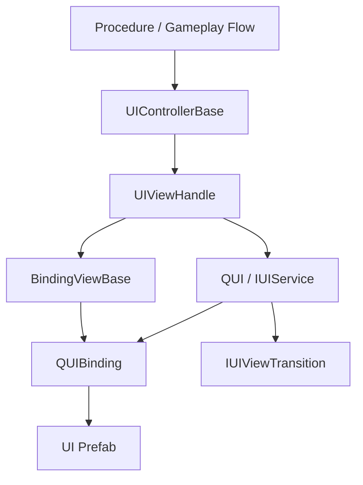
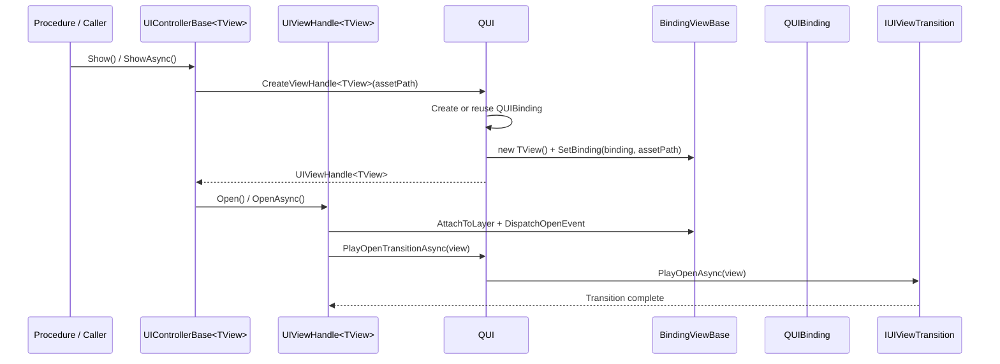
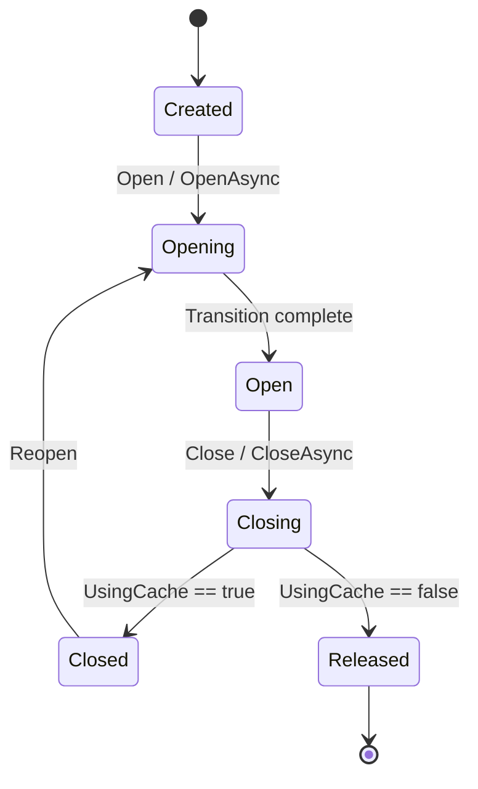

# EFrameWork UI Framework Guide

This document describes the current UI runtime structure in EFrameWork after the UI main chain was refactored to a handle-first model.

For the new browsable docs site, start from [Documentation~/index.html](../index.html) and then open [Documentation~/runtime/ui/index.html](../runtime/ui/index.html).

The key rule is simple: runtime UI lifecycle now flows through `QUI` + `UIViewHandle`, not through direct `BindingViewBase.Open/Close` calls.

## 0. Quick Visual Overview

### Structure Diagram



Reading order:

- business flow talks to controller
- controller owns the handle
- handle owns runtime lifecycle
- `QUI` owns host concerns such as binding creation, cache, layers, and transitions
- view stays close to prefab binding and typed component access

## 1. Core Roles

### `QUI`

`QUI` is the UI host owned by `EFrameContext`.

It is responsible for:

- creating `QUIBinding`
- creating `BindingViewBase` wrappers and `UIViewHandle<TView>` handles
- attaching UI to framework layers
- caching `QUIBinding` / `GameObject` instances
- owning the default `IUIViewTransition`
- owning optional navigation stack state

Access it through:

```csharp
var ui = EFrame.Current.UI;
```

### `BindingViewBase`

`BindingViewBase` is now a thin wrapper around a `QUIBinding`.

It is responsible for:

- exposing strongly typed component access from the binding prefab
- caching references in `OnBindingSet()`
- holding low-level lifecycle primitives used by the host / handle chain

It is no longer the public lifecycle API. Business code should not call `Open`, `Close`, `OpenAsync`, or `CloseAsync` on a view directly.

### `UIViewHandle<TView>`

`UIViewHandle<TView>` is now the runtime lifecycle owner.

It is responsible for:

- opening and closing the UI instance
- tracking runtime state such as `Created`, `Closed`, `Opening`, `Open`, `Closing`, `Released`
- preserving reusable cached instances in `Closed`
- providing the only public open/close surface for runtime flows

### `UIControllerBase<TView>`

`UIControllerBase<TView>` is the orchestration layer.

It is responsible for:

- deciding when a UI should show or hide
- owning the view handle
- binding instance-level events in `OnViewCreated()`
- refreshing per-open state in `OnViewOpened()`
- pausing per-open work in `OnViewClosed()` when close starts
- clearing instance-level state in `OnViewDestroyed()`

It now exposes:

- `ViewHandle` for non-generic access
- `TypedViewHandle` for strongly typed access

It no longer exposes the legacy `View` facade.

## 2. Runtime Structure

Current runtime UI folders under `packages/com.eframework.core/Runtime/UI/`:

- `BindingViewBase.cs`: thin wrapper base for bound views
- `QUI.cs`: UI host, cache owner, transition owner, navigation stack owner
- `QUIBinding.cs`: prefab binding component and `ViewConfig`
- `UIControllerBase.cs`: controller and popup controller base types
- `Handles/`: runtime handle abstractions
- `Transitions/`: host-owned default transition abstractions
- `Components/`: reusable UI controls such as `QScroller`, `QList`, `QTab`
- `Layout/`: screen fitting and safe-area utilities
- `UIHelper/`: helper/toolbox code
- `UIAnimation/`: reusable animation components

## 3. Recommended Flow

The normal runtime flow is:

1. controller asks `Context.UI` to create a `UIViewHandle<TView>`
2. `QUI` creates or reuses a `QUIBinding`
3. `QUI` creates a view wrapper and injects the binding through `SetBinding()`
4. controller opens or closes the UI through the handle
5. transition playback goes through `QUI` and `IUIViewTransition`
6. if caching is enabled, the handle closes into `Closed` instead of immediately releasing

### Show Flow Diagram



This is the most important mental model in the current framework:

- controller does not directly open the view
- view does not own creation
- host does not own business orchestration
- handle is the lifecycle pivot

## 4. Prefab Requirements

Each UI prefab should include a `QUIBinding`.

`QUIBinding` supplies:

- `DefaultLayer`
- `UsingCache`
- `AnimationRootName`
- `AnimationDuration`

Required framework sorting layers should already be created by project bootstrap:

- `QuiBackground`
- `QuiPanel`
- `QuiPopUp`
- `QuiTooltip`
- `QuiEffect`
- `QuiTop`

Do not create a separate top-level persistent Canvas outside `QUI` for normal framework UI.

## 5. Scene Camera Contract

Projects that use a separate scene camera and UI camera should mark every camera that can become the current scene render entry with `EFrameSceneCamera`.

`QUI` listens to those marker components through `OnEnable`, `OnDisable`, and `OnDestroy`, and also refreshes once during initialization and scene changes. There is no per-frame camera polling. When an enabled marked camera is selected, `QUI` configures the persistent UI camera as a URP Overlay camera and appends it to the selected scene camera stack.

Selection rules:

- higher `EFrameSceneCamera.Priority` wins
- if priority is equal, higher `Camera.depth` wins
- if both are equal, the most recently registered camera wins

Only cameras that should host the framework UI overlay should carry `EFrameSceneCamera`. Minimap, RenderTexture, screenshot, cutscene, and temporary effect cameras should leave the marker off unless they intentionally become the active scene render entry.

## 6. Basic View Example

Typical view class:

```csharp
using UnityEngine.UI;
using EFrameWork.Runtime.UI;

namespace Demo.UI.Views
{
    public sealed class HomeView : BindingViewBase
    {
        public HomeView()
        {
        }

        public Button StartButton { get; private set; }
        public Button BackButton { get; private set; }

        protected override void OnBindingSet()
        {
            CacheComponents();
        }

        private void CacheComponents()
        {
            StartButton = Binding == null ? null : Binding.transform.Find("Panel/StartButton")?.GetComponent<Button>();
            BackButton = Binding == null ? null : Binding.transform.Find("Panel/BackButton")?.GetComponent<Button>();
        }
    }
}
```

Notes:

- keep a parameterless constructor
- cache references in `OnBindingSet()`
- do not add your own public open/close lifecycle here

## 7. Basic Controller Example

Typical page controller:

```csharp
using System;
using Demo.Common;
using Demo.UI.Views;
using EFrameWork.Runtime.UI;

namespace Demo.UI.Controllers
{
    public sealed class HomeController : UIControllerBase<HomeView>
    {
        public Action BackRequested { get; set; }

        protected override string AssetPath => DemoResPath.MainView;

        protected override void OnViewCreated()
        {
            base.OnViewCreated();
            AddButtonClickListener(TypedViewHandle.TypedView.BackButton, OnBackButtonClick);
            AddButtonClickListener(TypedViewHandle.TypedView.StartButton, OnStartButtonClick);
        }

        protected override void OnViewOpened()
        {
            base.OnViewOpened();
            Context.Audio.PlaySfx("Audio/UI/Open");
        }

        protected override void OnViewDestroyed()
        {
            BackRequested = null;
            base.OnViewDestroyed();
        }

        private void OnBackButtonClick()
        {
            BackRequested?.Invoke();
        }

        private void OnStartButtonClick()
        {
            Context.Audio.PlaySfx("Audio/UI/Start");
        }
    }
}
```

Key point:

- access the live instance through `TypedViewHandle.TypedView`
- do not expect `controller.View`

## 8. Showing And Hiding UI

Show a page:

```csharp
var controller = new HomeController();
controller.Show();
```

Show with animation:

```csharp
await controller.ShowAsync();
```

Hide:

```csharp
controller.Hide();
```

Hide with animation:

```csharp
await controller.HideAsync();
```

If the underlying view is cache-enabled, the controller keeps a reusable handle instead of losing the instance immediately.

Lifecycle hooks are split by scope:

- `OnViewCreated()` / `OnViewDestroyed()` run when the wrapped view instance is created or released
- `OnViewOpened()` runs after each successful open
- `OnViewClosed()` runs when each close starts, while bound components are still available
- cache-enabled views close into `Closed`, so they do not call `OnViewDestroyed()` until the handle is force-destroyed or released

## 9. Popup Example

`UIPopupController<TView, TResult>` keeps the same handle-based lifecycle and adds a result model.

```csharp
using Cysharp.Threading.Tasks;
using EFrameWork.Runtime.UI;

namespace Demo.UI.Controllers
{
    public enum ConfirmResult
    {
        Cancel,
        Confirm
    }

    public sealed class ConfirmPopupController : UIPopupController<ConfirmPopupView, ConfirmResult>
    {
        protected override string AssetPath => DemoResPath.ConfirmPopup;

        protected override void OnViewCreated()
        {
            base.OnViewCreated();
            AddButtonClickListener(TypedViewHandle.TypedView.CancelButton, () => CloseWithResult(ConfirmResult.Cancel));
            AddButtonClickListener(TypedViewHandle.TypedView.ConfirmButton, () => CloseWithResult(ConfirmResult.Confirm));
        }
    }
}
```

Usage:

```csharp
var popup = new ConfirmPopupController();
var result = await popup.ShowAndWaitAsync(UILayer.QuiPopUp);

if (result == ConfirmResult.Confirm)
{
    // continue
}
```

## 10. Handle Access

When you need explicit lifecycle state:

```csharp
if (TypedViewHandle != null && TypedViewHandle.IsShowing)
{
    // already visible
}

if (TypedViewHandle != null && TypedViewHandle.State == UIViewHandleState.Closed)
{
    // cached instance exists and can reopen
}
```

Use handle state checks instead of trying to infer state from `GameObject.activeSelf` alone.

### Handle State Diagram



Interpretation:

- `Closed` means the cached instance can reopen without recreating the wrapper
- `Released` means the runtime instance is gone and the controller must create a new handle later

## 11. Navigation Stack

`QUI` navigation stack is now handle-first.

Push a handle:

```csharp
var handle = EFrame.Current.UI.CreateViewHandle<HomeView>(DemoResPath.MainView, UILayer.QuiPanel);
EFrame.Current.UI.PushView(handle, UILayer.QuiPanel);
```

Pop current:

```csharp
EFrame.Current.UI.PopView();
```

Pop all:

```csharp
EFrame.Current.UI.PopAll();
```

Read stack top:

```csharp
var topHandle = EFrame.Current.UI.TopView;
var topView = topHandle?.View;
```

### Navigation Stack Diagram

```mermaid
flowchart LR
    Caller[Caller] --> QUI
    QUI --> Stack[Stack<IUIViewHandle>]
    Stack --> Top[Top Handle]
    Top --> WrappedView[Wrapped BindingViewBase]

    Caller -->|PushView(handle)| QUI
    Caller -->|PopView()| QUI
    Caller -->|PopTo<T>()| QUI
```

## 12. Transitions

Default transitions are host-owned.

Current default path:

- `QUI` owns `DefaultTransition`
- `DefaultTransition` implements `IUIViewTransition`
- default implementation is `ScaleFadeViewTransition`

That means:

- views do not hardcode DOTween open/close behavior anymore
- host policy can be replaced later without rewriting every view
- interrupted transitions complete their await path through tween completion/kill callbacks
- stale async open/close completions are ignored by the handle if a newer operation has started

## 13. What Business Code Should Avoid

Avoid these patterns:

- calling lifecycle methods directly on `BindingViewBase`
- holding `BindingViewBase` as the controller runtime owner
- creating UI outside `QUI` layers
- putting business orchestration into the view class
- assuming cached controller state is the same thing as cached binding state
- writing raw Addressables UI paths repeatedly in business code

## 14. Minimal End-To-End Example

```csharp
using EFrameWork.Runtime.Procedure;

public sealed class LobbyProcedure : EFrameProcedure
{
    private HomeController m_homeController;

    protected override void OnEnter(ProcedureEnterContext context)
    {
        base.OnEnter(context);

        m_homeController = new HomeController
        {
            BackRequested = OnBackRequested
        };

        m_homeController.Show(UILayer.QuiPanel);
    }

    protected override void OnLeave(bool isShutdown)
    {
        m_homeController?.Hide();
        m_homeController = null;
        base.OnLeave(isShutdown);
    }

    private void OnBackRequested()
    {
        ChangeState<ProcedureMainMenu>();
    }
}
```

This is the preferred direction for the current framework:

- Procedure orchestrates
- controller owns the handle
- handle owns runtime lifecycle state
- `QUI` owns host concerns
- view stays thin and binding-focused
