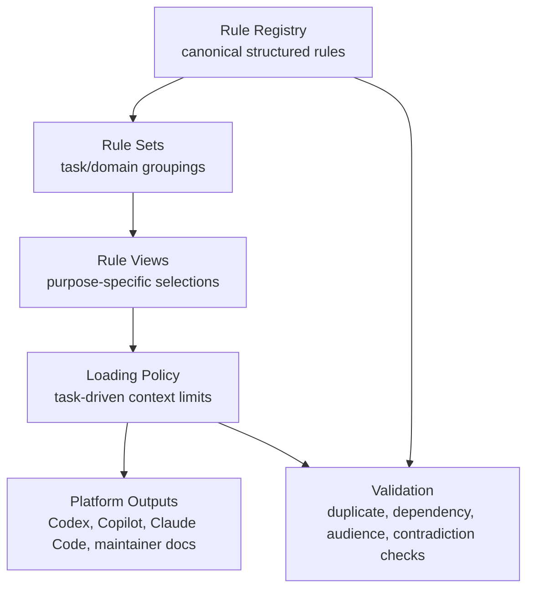

# EFrame AI Rule Information Architecture

This document defines the target information architecture for EFrame AI rules. It is maintainer-only and must not be synced to business projects.

## Design Principles

1. Each rule has one canonical definition.
2. Platform outputs such as synced instructions, skills, support docs, and managed blocks render rules; they do not become independent sources of truth.
3. Rule content is structured before wording is optimized.
4. Layering is explicit: governance, business contract, workflow, reference, validation, and platform output concerns are not mixed.
5. Loading policy limits context before platform output. A platform receives the smallest rule view it can reliably apply, in the file shape that platform needs.

## Target Layers



## Layer Definitions

| Layer | Purpose | Owns Canonical Text | Syncs To Business Projects |
| --- | --- | --- | --- |
| Rule Registry | Structured source of every AI rule | Yes | No, until generation is deliberately adopted |
| Rule Sets | Groups rules by domain, task, or audience | No | No |
| Rule Views | Selects rule IDs and rendering style for a purpose such as always-on boundaries, UI workflow, audit, or API lookup | No | No |
| Loading Policy | Maps task scenarios to rule views and context limits | No | No |
| Platform Outputs | Client-specific files, entry behavior, output paths, and activation text | No | Some outputs do |
| Validation | Checks integrity and drift | No | No |

Current validation entry: `tools/MaintainerAIWorkspace/Test-EFrameAIRuleArchitecture.ps1`.

New rule placement and review workflow: `tools/MaintainerAIWorkspace/AI_RULE_ADDITION_GUIDE.md`.

## Canonical Rule Schema

The eventual registry can be YAML or JSON. The schema should stay boring and tool-friendly.

```yaml
id: U01
title: Business UI entry
audience:
  - business-ai
domain: ui
layer: business-contract
status: stable
canonicalText: >
  Ordinary business UI enters through EFrame.UI and
  UIControllerBase<TGeneratedView>.
rationale: >
  Keeps business code on the framework-supported controller lifecycle
  and away from direct handle ownership.
appliesTo:
  paths:
    - "Assets/App/Runtime/**/*.cs"
    - "Assets/Modules/*/Runtime/**/*.cs"
  tasks:
    - ui
    - feature-bootstrap
forbiddenPatterns:
  - direct business UIViewHandle ownership
  - normal feature code using IUIService as entry point
dependsOn:
  - P04
supersedes: []
related:
  - U02
  - U03
canonicalOwner: rule-registry
rendering:
  instructions: summary
  skills:
    eframe-ui-feature: full
    eframe-guideline-audit: checklist
  supportDocs:
    EFRAME_AI_API_INDEX: api-note
validation:
  contradictionTerms:
    - "business code should own UIViewHandle"
```

## Required Fields

| Field | Meaning |
| --- | --- |
| `id` | Stable rule identifier. Never reuse an old ID for a different meaning. |
| `title` | Short maintainer label. |
| `audience` | `business-ai`, `maintainer-ai`, `human-maintainer`, or `platform-adapter`. |
| `domain` | `governance`, `startup`, `ui`, `resources`, `directory`, `data`, `editor`, `workflow`, `release`, or `platform`. |
| `layer` | `governance`, `business-contract`, `workflow`, `reference`, `validation`, `maintainer-only`, or `platform-adapter`. |
| `status` | `draft`, `candidate`, `stable`, `deprecated`, or `removed`. |
| `canonicalText` | The only full normative wording of the rule. |
| `appliesTo` | Path, task, or capability triggers. |
| `dependsOn` | Other rule IDs needed to interpret this rule correctly. |
| `rendering` | Where this rule may appear and at what detail level. |

## Rendering Levels

| Level | Use |
| --- | --- |
| `full` | The rendered file may include the full canonical text. Use sparingly. |
| `summary` | The rendered file may contain a short restatement with no new semantics. |
| `checklist` | The rendered file may turn the rule into a verification question. |
| `handoff` | The rendered file should point to another rule view or skill. |
| `api-note` | The rendered file may mention the API entry and a short avoid/use note. |
| `none` | The rule must not appear in that surface. |

## Rule View Types

| View | Role | Allowed Detail |
| --- | --- | --- |
| Root managed block | Minimal activation and routing | `summary`, `handoff` |
| Always-on instruction | Short stable boundaries | `summary`, rare `full` |
| Workflow skill | Task execution steps | `full`, `summary`, `handoff` |
| Skill reference | Detailed checklist | `checklist`, `full` when it is the owner |
| API index | Lookup map plus short behavioral notes | `api-note`, `summary` |
| Maintainer checklist | Release and sync gate | `full` for maintainer-only rules |
| Platform output | Client-specific activation mechanics and file shape | `handoff`, `summary` |

## Single-Source Rule Ownership

During migration, `AI_RULE_INVENTORY.md` is a human-maintained bridge. The final desired state is:

1. A rule's normative wording lives in the registry.
2. Platform output markdown may include only permitted render levels.
3. If two platform outputs need the same rule, they reference the same rule ID.
4. If wording changes, the registry changes first, then platform outputs update.
5. Release checks verify that no platform output introduces a second full normative copy unless the registry allows it.

## Platform Output Boundary

Platform outputs combine what was previously separated as rendered files and platform adapters. They should answer only these questions:

- Where does this client read entry instructions?
- Can this client load skills automatically, manually, or not at all?
- What file shape does this client require?
- Which rule views should this client receive?
- What activation text is needed to route the client to the right synced files?
- Where should the output be written in the framework source and in the synced business project?
- Is the output synced, maintainer-only, or local to the framework repository?

Platform outputs must not redefine EFrame business rules. They only render or point to rule views.

## Migration Sequence

1. Freeze the current inventory and assign stable rule IDs in `AI_RULE_INVENTORY.md`.
2. Convert the inventory into a structured registry draft at `rules/registry.yaml`.
3. Define rule sets for common task domains in `rules/rule-sets.yaml`: UI, resources, data, directory, editor, procedure, audit, release.
4. Define rule views for current purposes in `rules/rule-views.yaml`: always-on, workflow, API lookup, audit, release, and setup.
5. Define task-driven loading policy in `rules/loading-policy.yaml` so agents can avoid unrelated rule views.
6. Define output migration order in `AI_RULE_OUTPUT_MIGRATION_PLAN.md`.
7. Define platform outputs for Codex, Copilot, Claude Code, maintainer docs, and package sync files through the rule views.
8. Normalize duplicated platform outputs so they carry summaries, checklists, or handoffs instead of full duplicate wording.
9. Add validation for duplicate full wording, dangling dependencies, wrong audience, and platform-output leakage.
10. Only then consider generating platform outputs.

## First Architecture Milestone

The first milestone is complete when maintainers can answer these questions without opening every synced file:

- Which rule is canonical?
- Which platform outputs render it?
- Which files only summarize or check it?
- Which audience owns it?
- Which rules depend on it?
- Which platform outputs activate it?
