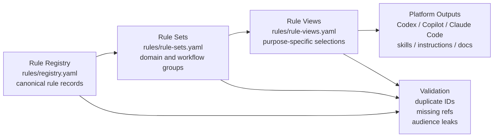
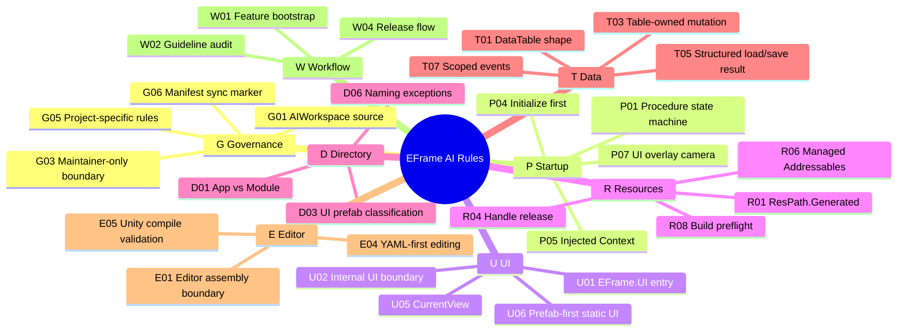
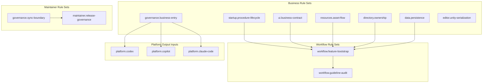
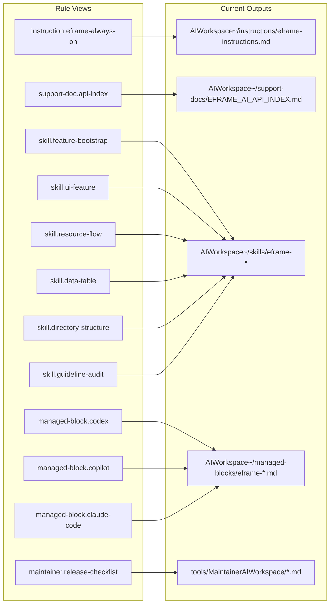
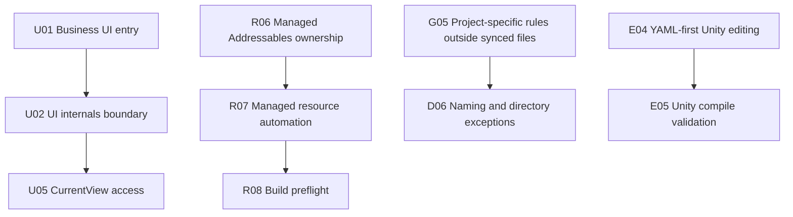
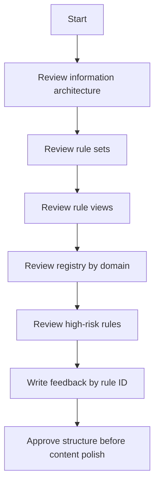

# EFrame AI Rule Visual Review

This maintainer-only review guide provides visual entry points for checking the rule architecture before editing synced AI files.

## Architecture Map



Review question: does each layer have a single job, and does any lower layer redefine a rule that should live in the registry?

## Domain Map



Review question: are the domains right, or should any rule move to another domain before we polish wording?

## Rule Set Map



Review question: do the sets match how maintainers think about EFrame work?

## View To Output Map



Review question: should any view include fewer rules and use handoff instead of summary or full text?

## High-Risk Rule Paths



Review these first because they most directly affect AI behavior and drift risk:

| Rule | Review Focus |
| --- | --- |
| `U02` | Business files must not imply ordinary feature code should own `QUI`, `IUIService`, or `UIViewHandle`. |
| `U05` | Confirm `CurrentView` is the only business-facing generated view access pattern. |
| `E04` | Confirm YAML-first editing is correct and Editor API remains fallback only. |
| `R06` | Confirm managed Addressables ownership is strict enough. |
| `G05` | Confirm project-specific rules never belong in synced `eframe-*` files. |

## Suggested Review Flow



Use short feedback by rule ID:

```text
U02: make canonical text stronger.
E04: OK.
R06/R07: split ownership and automation more clearly.
instruction.eframe-always-on: too many fullRules.
platform.codex: should include E04 summary.
```

