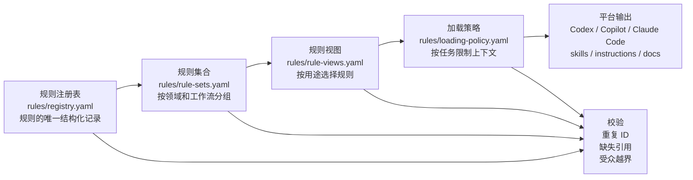
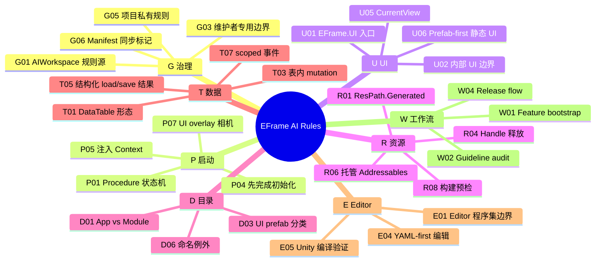
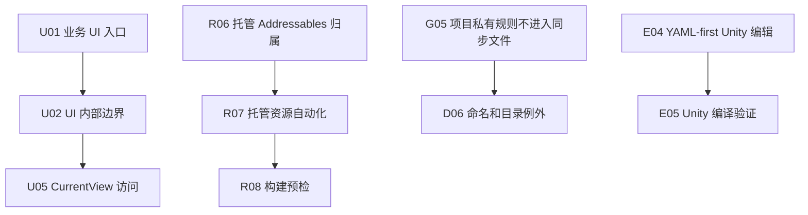
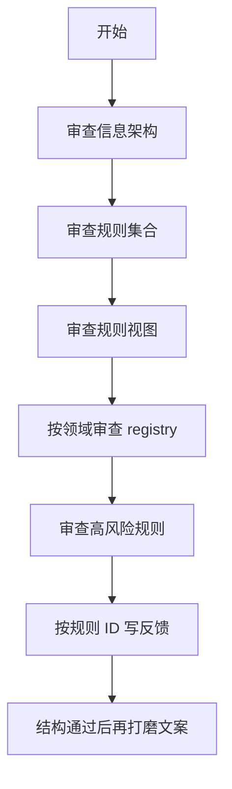

# EFrame AI 规则可视化审查

这份文档是维护者专用的审查入口，用来在修改同步 AI 文件前，先用图形方式检查规则信息架构。

按需加载模拟结果见 [AI_RULE_LOADING_SIMULATION.md](./AI_RULE_LOADING_SIMULATION.md)。
同步输出迁移顺序见 [AI_RULE_OUTPUT_MIGRATION_PLAN.md](./AI_RULE_OUTPUT_MIGRATION_PLAN.md)。

## 架构图



审查问题：每一层是否只有一个明确职责？下游层是否重新定义了本应属于 registry 的规则？

## 领域图



审查问题：这些领域划分是否正确？在打磨具体文案前，有没有规则应该移动到其他领域？

## 规则集合图


审查问题：这些集合是否符合维护者理解 EFrame 工作的方式？有没有集合太大、太小，或应该拆分？

## 视图到输出图


审查问题：有没有视图包含了过多规则？是否应该从 `summary` 或 `full` 改成 `handoff`？

## 高风险规则路径



优先审查这些规则，因为它们最直接影响 AI 行为和 drift 风险：

| 规则 | 审查重点 |
| --- | --- |
| `U02` | 业务文件不能暗示普通功能代码应该直接持有 `QUI`、`IUIService` 或 `UIViewHandle`。 |
| `U05` | 确认 `CurrentView` 是业务侧唯一推荐的生成 View 访问方式。 |
| `E04` | 确认 YAML-first 编辑口径正确，Editor API 仍然只是 fallback。 |
| `R06` | 确认托管 Addressables 归属边界足够严格。 |
| `G05` | 确认项目私有规则绝不应该写入同步得到的 `eframe-*` 文件。 |

## 建议审查流程



建议用短反馈，直接按规则 ID 或视图 ID 写：

```text
U02: canonical text 需要更强硬。
E04: OK。
R06/R07: 归属和自动化需要拆得更清楚。
instruction.eframe-always-on: fullRules 太多。
platform.codex: 应该包含 E04 summary。
```
